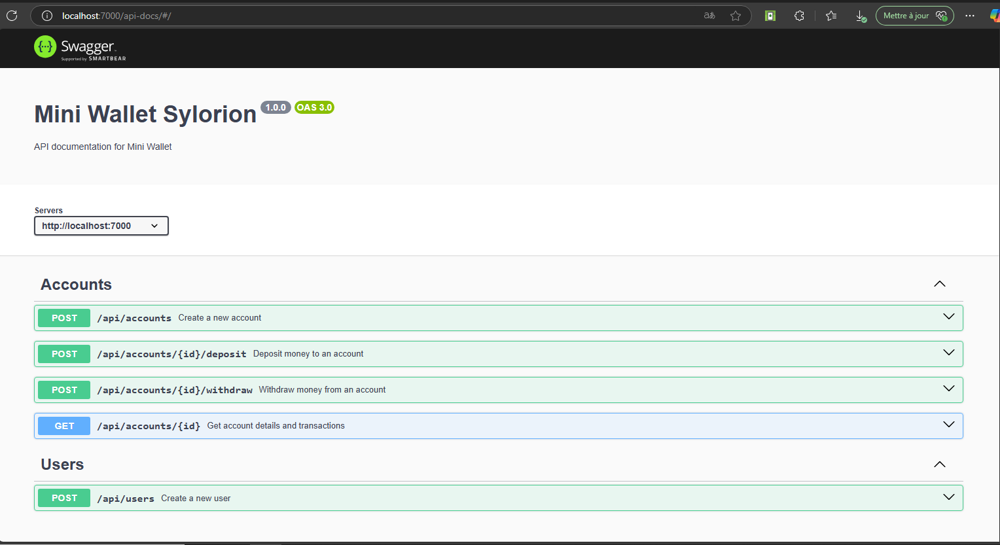

# Mini Wallet API

Mini Wallet API est une application **Express + TypeScript** qui permet de gérer des comptes bancaires avec **Prisma, SQLite, JWT et Swagger**.

## 🛠️ Technologies utilisées

- **TypeScript** : Langage typé pour JavaScript
- **Express.js** : Framework web minimaliste pour Node.js
```bash 
https://expressjs.com/fr/starter/hello-world.html
 ```
- **Prisma** : ORM moderne pour interagir avec SQLite
```bash 
https://www.prisma.io/docs/getting-started/quickstart-sqlite
 ```
- **SQLite** : Base de données légère
- **JWT (JSON Web Token)** : Authentification sécurisée des utilisateurs
- **Swagger** : Documentation automatique de l'API
```bash 
https://dev.to/cuongnp/swagger-nodejs-express-a-step-by-step-guide-4ob
 ```
- **bcrypt.js** : Hashing sécurisé des mots de passe


---

## 📌 Installation

### 1️⃣ Cloner le projet
```sh
git clone https://github.com/sylorion/mini-wallet-one-day.git
cd mini-wallet
```

### 2️⃣ Installer les dépendances
```sh
npm install
```

### 3️⃣ Configurer les variables d'environnement
Créer un fichier .env et ajouter :  
    **PORT=7000**  
    **JWT_SECRET=supersecretkey**  
    **DATABASE_URL="file:./dev.db"**  

### 4️⃣ Initialiser Prisma
```sh
npx prisma migrate dev --name init
npx prisma generate
```
#### Schéma prisma
<details>
```prisma
generator client {
  provider = "prisma-client-js"
}

datasource db {
  provider = "sqlite"
  url      = env("DATABASE_URL")
}

model User {
  id       Int      @id @default(autoincrement())
  username String   @unique
  email    String   @unique
  password String
  accounts Account[]
}

model Account {
  id           Int           @id @default(autoincrement())
  balance      Float         @default(0)
  userId       Int
  user         User          @relation(fields: [userId], references: [id])
  transactions Transaction[]
}

model Transaction {
  id        Int      @id @default(autoincrement())
  type      String   // "deposit" ou "withdraw"
  amount    Float
  accountId Int
  createdAt DateTime @default(now())
  account   Account  @relation(fields: [accountId], references: [id])
}

</details>``` 

### 5️⃣ Lancer le serveur
```sh
npm start
```

---


## 🚀 API Documentation
L'API est documentée avec Swagger.

Vous pourrez accéder à la documentation via ce lien 
(NB: Le serveur doit être lancé)

```bash
http://localhost:7000/api-docs
```

